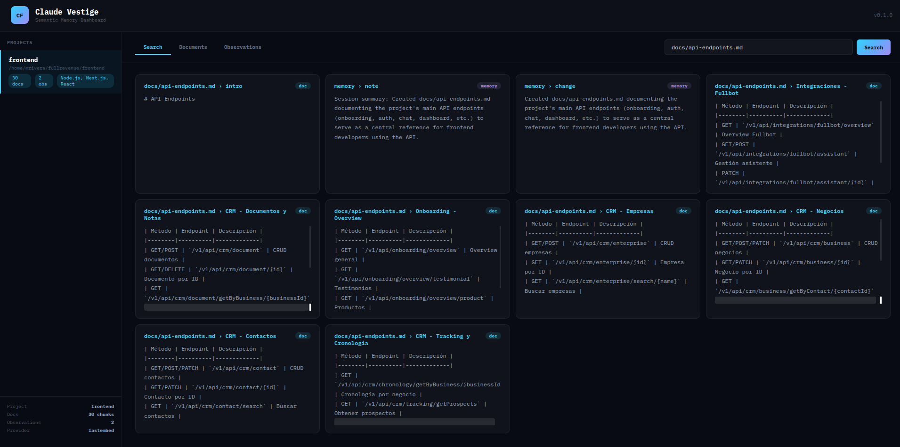
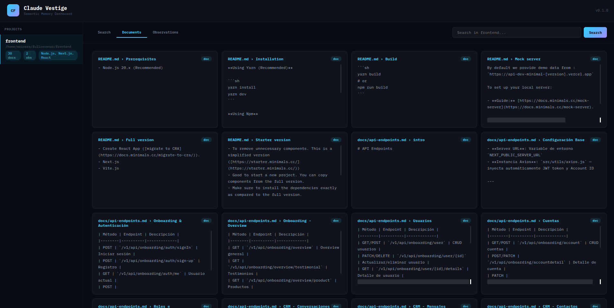
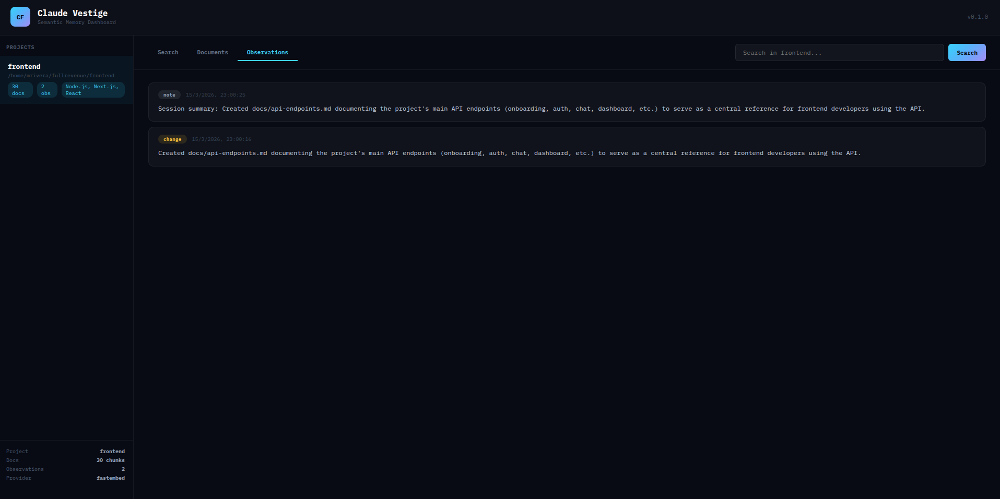

# Claude Vestige

Persistent semantic memory plugin for Claude Code. Automatically captures context from your coding sessions and injects relevant knowledge into future conversations.

## What it does

- **SessionStart**: Auto-indexes `README.md` and `CLAUDE.md`, injects relevant context from ChromaDB
- **PostToolUse**: Haiku analyzes file changes and generates observations (what was done and why)
- **Auto-index**: New `.md` files created by Claude are automatically indexed
- **Stop**: Saves a session summary for future reference

Works with Claude Code CLI, VS Code extension, and Windsurf. Compatible with Linux and macOS.

## Dashboard

Explore indexed documents, observations, and semantic search across all your projects.

### Search


### Documents


### Observations


## Installation

### Quick install (recommended)

```bash
curl -sSL https://raw.githubusercontent.com/MrMokuchoDev/claude-vestige/main/install.sh | bash
```

### Clone and install

```bash
git clone https://github.com/MrMokuchoDev/claude-vestige.git
cd claude-vestige
./install.sh
```

After installing, **restart Claude Code** completely (close and reopen terminal/IDE).

### Prerequisites

- Python 3.11+
- `python3-venv` (`sudo apt install python3-venv` on Debian/Ubuntu)
- Claude Code CLI (`npm install -g @anthropic-ai/claude-code`)

## Usage

Open Claude Code in any project:

```bash
cd /path/to/your/project
claude
```

Claude Vestige works automatically — no `--plugin-dir` or extra configuration needed.

### First session in a project

1. The plugin creates `.claude-vestige/` in the project root
2. Indexes `README.md` and `CLAUDE.md` if they exist
3. Injects the indexed content as context for Claude

### Subsequent sessions

1. Previous observations and indexed docs are injected at session start
2. Claude already knows what happened in prior sessions
3. New file changes continue to be captured

### Commands

#### `/bootstrap` — Index files into memory

Index additional files into the project's semantic memory. You can use the short or full form:

```
/bootstrap
/claude_vestige:bootstrap
```

Claude will show which files are already indexed and suggest candidates. You can also index specific files directly:

```
/claude_vestige:bootstrap --include docs/architecture.md internal_docs/decisions.md
```

Files explicitly requested are always indexed, even if they're in `.gitignore` or `.git/info/exclude`.

#### `/search` — Search project memory

Search across all indexed documents and session observations. Short or full form:

```
/search how does authentication work
/claude_vestige:search how does authentication work
```

Uses semantic similarity (not just keyword matching) to find relevant chunks from docs and past session observations.

### Update

To update to the latest version, run the install command again:

```bash
curl -sSL https://raw.githubusercontent.com/MrMokuchoDev/claude-vestige/main/install.sh | bash
```

### Dashboard

```bash
~/.claude-vestige/.venv/bin/python -m claude_vestige.api --port 7843
```

Open `http://localhost:7843` in your browser.

## For developers

### Local development

```bash
git clone https://github.com/MrMokuchoDev/claude-vestige.git
cd claude-vestige
python3 -m venv .venv
.venv/bin/pip install -e ".[dev,dashboard]"
```

Run with `--plugin-dir` for testing:

```bash
cd /path/to/any/project
claude --plugin-dir /path/to/claude-vestige/claude-vestige-plugin
```

### Running tests

```bash
.venv/bin/python -m pytest tests/ -q
```

### Project structure

```
claude-vestige/
├── claude_vestige/              # Python package (pip install)
│   ├── store.py                 # ChromaDB interface
│   ├── ingester.py              # Markdown chunking
│   ├── embeddings.py            # fastembed provider
│   ├── config.py                # Config loader + gitignore
│   ├── memory.py                # save_memory
│   ├── bootstrap.py             # Stack detection + indexing
│   ├── cli.py                   # CLI commands (search, bootstrap, status)
│   └── api.py                   # Dashboard FastAPI
│
├── claude-vestige-plugin/       # Claude Code plugin
│   ├── .claude-plugin/plugin.json
│   ├── hooks/
│   │   ├── hooks.json
│   │   ├── session_start.py     # Injects context
│   │   ├── user_prompt.py       # Captures user prompt
│   │   ├── post_tool_use.py     # Haiku analyzes + saves observations
│   │   └── stop.py              # Session summary
│   └── skills/
│       ├── bootstrap/SKILL.md
│       └── search/SKILL.md
│
├── install.sh                   # One-step installer
├── pyproject.toml
└── tests/
```

## Stack

| Component | Library |
|---|---|
| Vector DB | ChromaDB (embedded, per-project) |
| Embeddings | fastembed (ONNX, in-process) |
| Hybrid search | rank_bm25 |
| Observations | Haiku via Claude Code hooks |
| Dashboard | FastAPI + vanilla HTML/JS |

## Uninstall

```bash
claude plugin uninstall claude-vestige
claude plugin marketplace remove claude-vestige-tools
rm -rf ~/.claude-vestige
```

To remove project data, delete `.claude-vestige/` from each project directory.

## License

[MIT](LICENSE)
